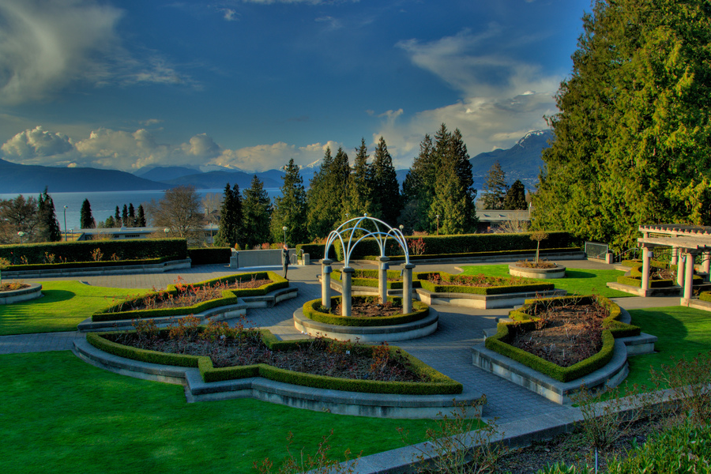
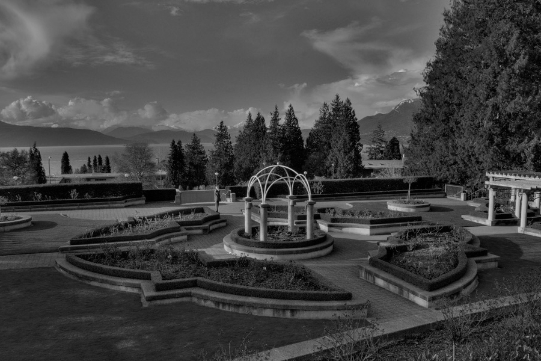
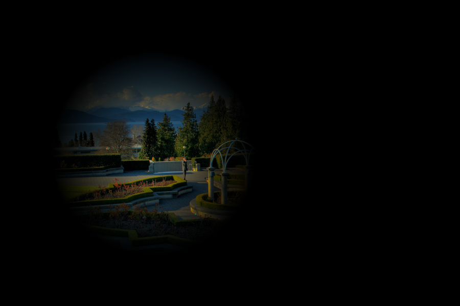
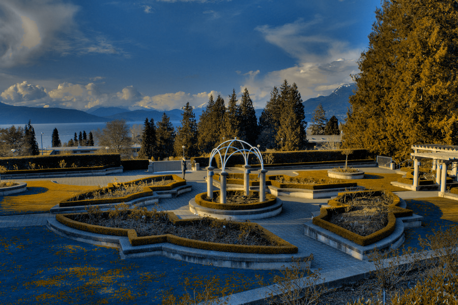
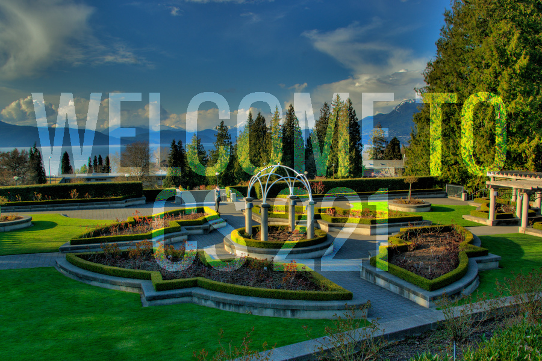

# PNG-manipulation
A tool developed to manipulate PNG file. The manipulation methods include: transform-to-greyscale, create-a-spotlight, add-filter, and add-watermark.

## Purposes
The main purpose of this project is to pratice C++. This project can be further extended to other picture editing tools, such as personalized photo filters, etc.

## Technologies
- C++

## Demo
### Manipulation method 1: Transform-to-greyscale
change the saturation of every pixel to 0.

Original PNG:

Greyscale PNG:

### Manipulation method 2: Create-a-spotlight
Create a spotlight centered at (x,y). adjusts the luminance of a pixel based on the distance the pixel is away from the center.

Spotlight PNG centered at (300,300):

### Manipulation method 3: Add-filter
Change the hue of every pixel to either yellow or blue, based on if the pixel's hue value is closer to yellow than blue.

Added filter PNG:

### Manipulation method 4: Add-watermark
The luminance of every pixel of the overlay image is checked, if that pixel's luminance is 1 (100%), then the pixel at the same location on the first image has its luminance increased by 0.2.

Added watermark PNG:

## Notes
Part of the codes was provided by the author. I created the HSLAPixel class and the PNG manipulation functions.

Copyright (c) 2020 Cinda Heeren
